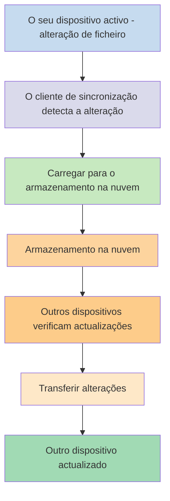
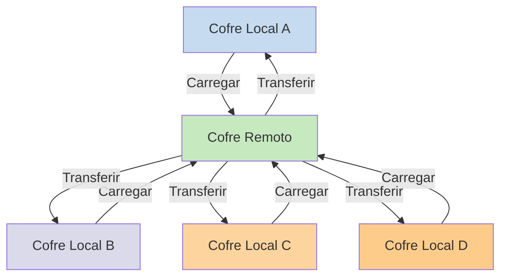

Se pretende utilizar as suas notas em diferentes dispositivos, uma das opções disponíveis é [[Sincronizar as suas notas entre dispositivos]]. O Obsidian oferece um desses serviços, [[Introdução ao Obsidian Sync|Obsidian Sync]], que funciona de forma diferente de outros serviços de sincronização, como o [[Sincronizar as suas notas entre dispositivos#iCloud|iCloud]] e o [[Sincronizar as suas notas entre dispositivos#OneDrive|OneDrive]].

Seguem-se alguns termos essenciais:

- Um **cofre** é uma pasta no seu sistema de ficheiros que contém notas e uma pasta `.obsidian` com a configuração específica do Obsidian.
- Um **cofre local** é a cópia do seu cofre que existe em cada um dos seus dispositivos. Ao utilizar serviços de sincronização, liga estes cofres locais para permitir a sincronização.
- Um **cofre remoto** é um armazenamento centralizado ao qual os cofres locais se ligam directamente através do Obsidian Sync.

Existem duas abordagens comuns para a sincronização:

- **[[#File-based sync services|Serviços de sincronização baseados em ficheiros]]**: Os cofres locais devem estar em pastas monitorizadas, a sincronização ocorre através do sistema de ficheiros.
- **[[#Obsidian Sync|Cofres remotos]]**: Armazenamento centralizado ao qual os cofres locais se ligam directamente através do Obsidian.

## Serviços de sincronização baseados em ficheiros

Serviços como o Dropbox, Google Drive, iCloud e OneDrive são baseados em pastas. Estes serviços monitorizam pastas específicas e sincronizam automaticamente quaisquer ficheiros colocados dentro delas. Os ficheiros devem estar nas pastas designadas do serviço de nuvem para serem sincronizados. Com os serviços de sincronização baseados em ficheiros, o seu cofre local funciona como apenas mais uma pasta a ser monitorizada. Não existe um cofre remoto dedicado — em vez disso, o armazenamento na nuvem serve como intermediário, copiando ficheiros entre cofres locais em diferentes dispositivos.

O diagrama abaixo mostra uma versão simplificada de como estes serviços funcionam:

Se o serviço de nuvem tiver sincronização em segundo plano, alguns destes processos podem estar a ocorrer mesmo quando não está a utilizar activamente as aplicações para ver os ficheiros. Estes serviços monitorizam pastas específicas e sincronizam automaticamente quaisquer ficheiros colocados dentro delas. Os ficheiros devem estar nas pastas designadas do serviço de nuvem para serem sincronizados.

## Obsidian Sync

O Obsidian Sync permite-lhe criar um cofre remoto que serve como armazenamento centralizado através do seu serviço [[Introdução ao Obsidian Sync|Obsidian Sync]]. Isto permite-lhe escolher quase qualquer pasta em qualquer um dos seus dispositivos para armazenar os seus ficheiros — seja num disco externo, em `C:\`, ou no armazenamento da aplicação no Android.

No entanto, temos uma lista de localizações recomendadas para o seu cofre local caso também utilize [[#File-based sync services|serviços de sincronização baseados em ficheiros]] no mesmo dispositivo — principalmente, em qualquer local que não esteja num [[Migrar para o Obsidian Sync#Move your vault out of your third-party syncing service or cloud storage|serviço de sincronização de terceiros]].

O diagrama abaixo mostra uma versão simplificada de como o Obsidian Sync funciona:

A força deste sistema torna-se mais evidente com mais tipos de dispositivos. Os [[#File-based sync services|serviços de sincronização baseados em ficheiros]] podem ser implementados de forma inconsistente entre sistemas operativos, e os dispositivos móveis têm as suas próprias regras sobre como as aplicações podem ser isoladas e com o consumo de energia limitado, o que torna muito mais difícil para os serviços tradicionais baseados em ficheiros funcionarem de forma integrada.

Com o Obsidian Sync, o serviço gere a sincronização directamente através da aplicação, proporcionando um comportamento consistente independentemente do tipo de dispositivo ou das limitações do sistema operativo, enquanto dá prioridade à manutenção de uma cópia local dos seus dados como [[Criar cópia de segurança dos seus ficheiros do Obsidian|cópia de segurança ligeira]].

### Comportamento da sincronização

Quando efectua alterações aos ficheiros no seu cofre local, o Obsidian Sync detecta essas alterações e carrega-as para o cofre remoto. Os outros dispositivos ligados ao mesmo cofre remoto irão então transferir essas alterações e aplicá-las aos seus cofres locais. O Obsidian Sync acompanha as alterações ao nível do ficheiro e apenas transfere os ficheiros que foram modificados, em vez de sincronizar pastas inteiras. Isto reduz a utilização de largura de banda e o tempo de sincronização.

Quando ocorrem conflitos ou quando precisa de controlar quais os ficheiros a sincronizar, o Obsidian Sync fornece mecanismos específicos para lidar com estas situações:

![[Resolução de problemas do Obsidian Sync#Conflict resolution|Resolução de conflitos]]

![[Configurações do Sync e sincronização selectiva#Selective syncing#Exclude a folder from syncing]]

### Comportamento offline

As alterações efectuadas offline são colocadas em fila e sincronizadas automaticamente quando o seu dispositivo se volta a ligar à internet e o Obsidian está aberto. O seu cofre local permanece totalmente funcional durante os períodos offline.

## Próximos passos

- [[Configurar o Obsidian Sync]] para começar a utilizar cofres remotos.
- [[Migrar para o Obsidian Sync]] se está actualmente a utilizar sincronização baseada em ficheiros e pretende usar o Obsidian Sync.
- [[Sincronizar as suas notas entre dispositivos|Explore outras opções de sincronização]] se ainda estiver a decidir.
