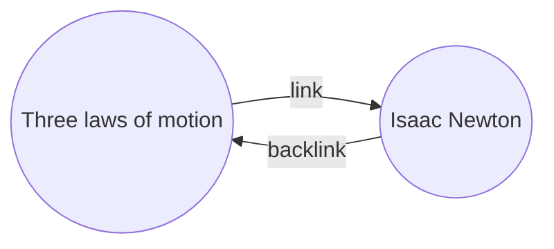

Com o [[Plugins nativos|plugin]] Links inversos, pode ver todos os _links inversos_ da nota ativa.

Um link inverso de uma nota é uma ligação de outra nota para essa nota. No exemplo seguinte, a nota "Três leis do movimento" contém uma ligação para a nota "Isaac Newton". O link inverso correspondente ligaria de "Isaac Newton" de volta para "Três leis do movimento".

Os links inversos podem ser úteis para encontrar notas que referenciam a nota que está a escrever. Imagine se pudesse listar os links inversos de qualquer site na internet.

## Mostrar links inversos

O plugin Links inversos apresenta os links inversos dos separadores ativos. Existem duas secções recolhíveis: **Menções ligadas** e **Menções não ligadas**.

- **Menções ligadas** são links inversos para as notas que contêm uma ligação interna para a nota ativa.
- **Menções não ligadas** são links inversos para qualquer ocorrência não ligada do nome da nota ativa.

Oferece as seguintes opções:

- **Recolher resultados** alterna entre expandir cada nota para apresentar as menções nela.
- **Mostrar mais contexto** alterna entre truncar ou apresentar o parágrafo completo que contém a menção.
- **Alterar ordem de ordenação** determina como ordenar as menções.
- **Mostrar filtro de pesquisa** alterna um campo de texto que lhe permite filtrar as menções. Para mais informações sobre como construir um termo de pesquisa, consulte [[Pesquisa]].

## Ver links inversos de uma nota

Para ver os links inversos da nota ativa, clique no separador **Links inversos** ![[obsidian-icon-links-coming-in.svg#icon]] na barra lateral direita.

> [!note] Nota
> Se não conseguir ver o separador Links inversos, pode torná-lo visível abrindo a [[Paleta de comandos]] e executando o comando **Links inversos: Mostrar links inversos**.

> [!info] Ficheiros excluídos
> Os ficheiros que correspondam aos seus padrões de [[Configurações#Excluded files|Ficheiros excluídos]] não aparecerão nas Menções não ligadas.

## Ver links inversos de uma nota específica

O separador de links inversos lista os links inversos da nota ativa e atualiza quando muda para uma nota diferente. Se pretender ver os links inversos de uma nota específica, independentemente de estar ativa ou não, pode abrir um separador de links inversos _vinculado_.

Para abrir um separador de links inversos vinculado:

1. Abra a [[Paleta de comandos]].
2. Selecione **Links inversos: Abrir links inversos para a nota atual**.

Um separador separado abre-se junto à sua nota ativa. O separador mostra um ícone de ligação para indicar que está vinculado a uma nota.

## Mostrar links inversos numa nota

Em vez de mostrar os links inversos num separador separado, pode mostrá-los no final da sua nota.

Para mostrar links inversos numa nota:

1. Abra a [[Paleta de comandos]].
2. Selecione **Links inversos: Alternar links inversos no documento**.

Ou ative **Link inverso no documento** nas opções do plugin Links inversos para alternar automaticamente os links inversos quando abre uma nova nota.
